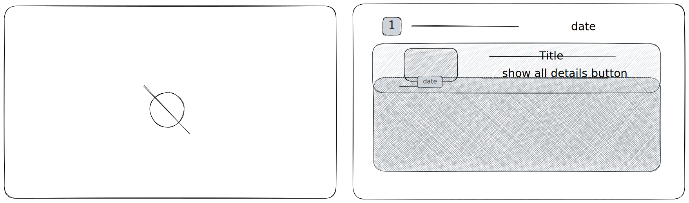
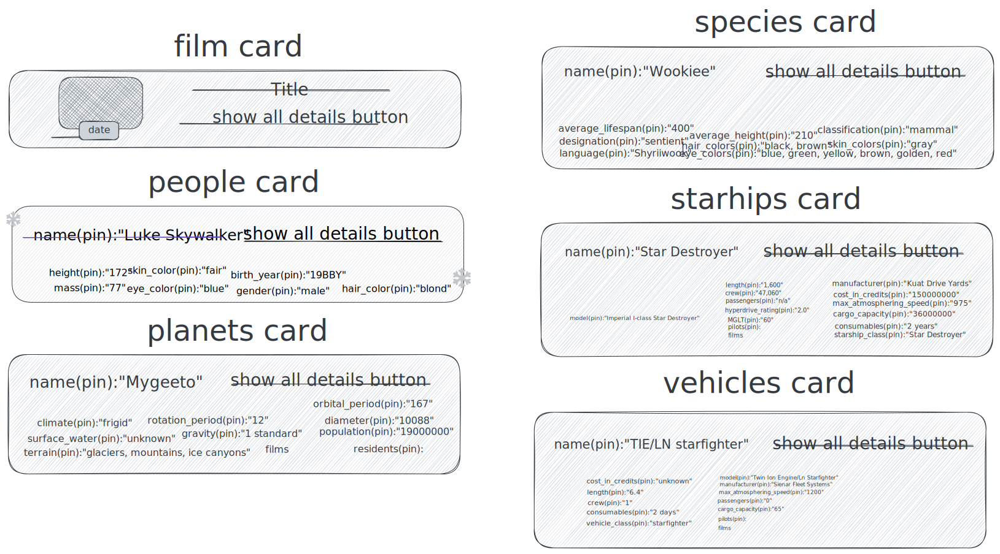

<div align="center">
<br/>
<a href="https://the-christmas-star-wars.netlify.app">

</a>
<p><b><h1>A Star Wars-themed Christmas web application</h1></b></p>
<p><h4>``May the force be with you, always``</h4></p>
</div>

## Installation

To install christmas-movie-app, follow these steps:
Clone the repository:

```
git clone `repository_url`
```

Navigate to the project directory:

```
cd star-wars-christmas-app
```

Install dependencies:

```
npm install
```

Run the app:

```
npm start
```

live demo link here:
> [live link](https://the-christmas-star-wars.netlify.app/)

## Design and UI

### Slider detail page design

&nbsp;&nbsp;&nbsp;&nbsp;&nbsp;&nbsp;
<br/>

### Cards design component



