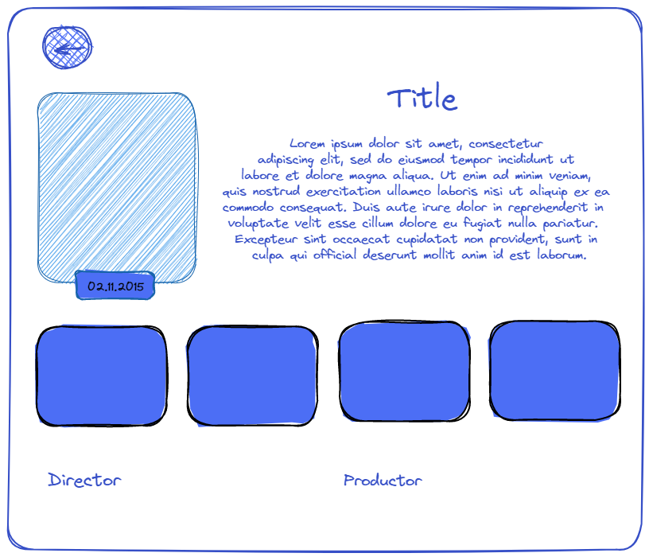
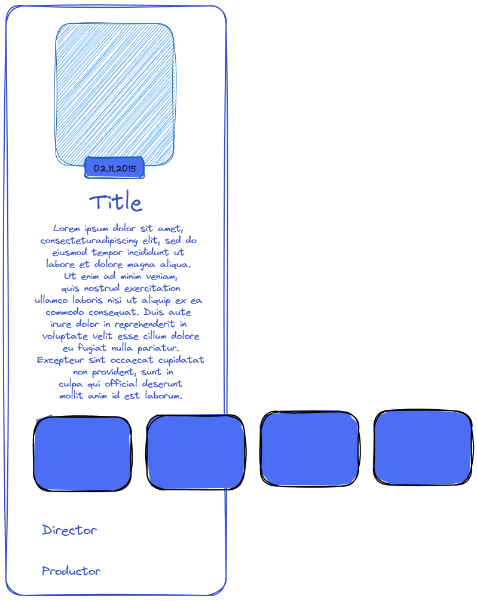

<div align="center">
<br/>
<a href="https://lefine.netlify.app/">

</a>
<p><b><h1>A Star Wars-themed Christmas web application</h1></b></p>
<p><h4>``May the force be with you, always``</h4></p>

## Installation

To install Lefine, follow these steps:
Clone the repository:
```
git clone `repository_url`
```
Navigate to the project directory:
```
cd star-wars-christmas-app
```
Install dependencies:
```
npm install
```
Run the app:
```
npm start
```

live demo link here:
> [live link](https://the-christmas-star-wars.netlify.app/)

## Design and UI
### Slider detail page 
&nbsp;&nbsp;&nbsp;&nbsp;&nbsp;&nbsp;

